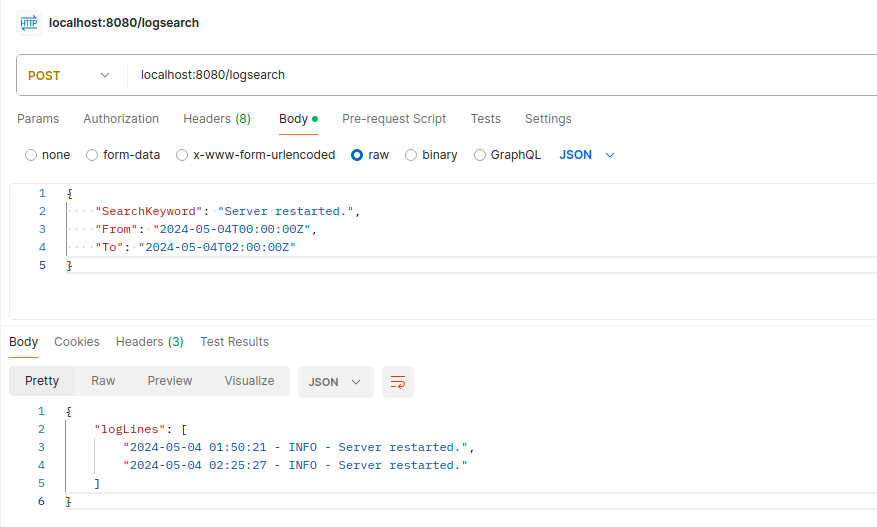

# Log Serach Server

This is a RESTful API server implemented in Go for searching log lines from a remote storage based on the provided criteria.

## Structure

├── api
├── cmd
│   └── api
│       └── main.go
├── go.mod
├── go.sum
├── image-1.png
├── pkg
│   └── model
│       ├── request.go
│       └── response.go
├── README.md
└── server
    ├── app.go
    ├── handler.go
    ├── handler_test.go
    └── helper.go

## Environment Configuration

Before running the application, make sure you set the following environment variables:

- `AWS_S3_BUCKET_NAME`: The name of your AWS S3 bucket where log files are stored.
- `AWS_REGION`: The AWS region where your S3 bucket is located.

You can set these environment variables using the following commands:

```bash
export AWS_S3_BUCKET_NAME=your-bucket-name
export AWS_REGION=your-aws-region
```

## Installation and Usage

    git clone https://github.com/your/repository.git
    cd your-project-directory
    go run ./cmd/api
    Send HTTP requests to the API endpoints to search for log lines.

## API Endpoints
POST /search: Search for log lines based on provided criteria.

## Sample Postman request
